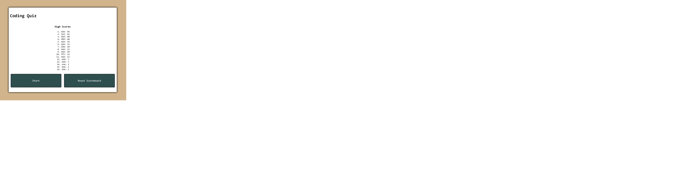
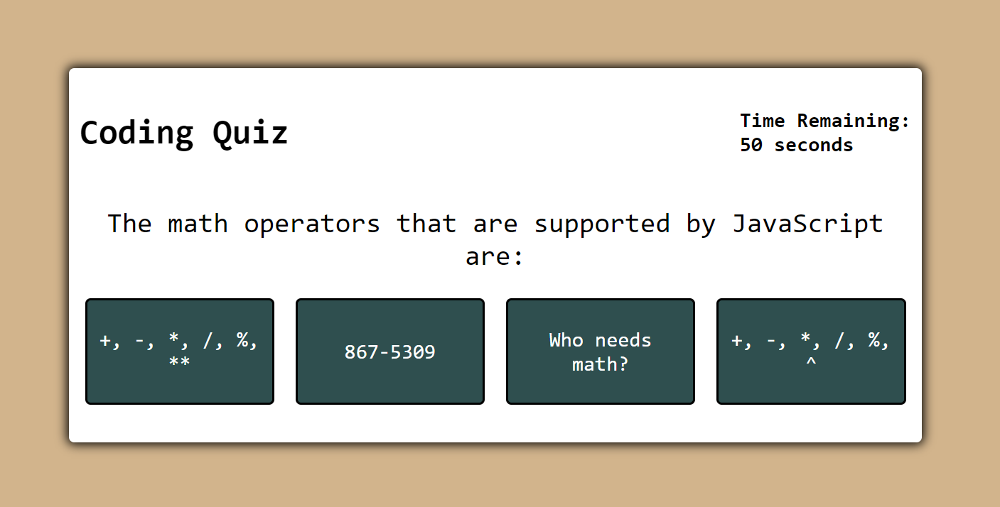

# Challenge-04-Web-APIs-Code-Quiz

The objective of this assignment is to build a trivia app that can runs on a timer, has a time penalty for wrong answers, and can store the time left as a score that can be later viewed on a high scoreboard.

**User Story**
```
AS A coding boot camp student
I WANT to take a timed quiz on JavaScript fundamentals that stores high scores
SO THAT I can gauge my progress compared to my peers
```

**Acceptance Criteria**
```
GIVEN I am taking a code quiz
WHEN I click the start button
THEN a timer starts and I am presented with a question
WHEN I answer a question
THEN I am presented with another question
WHEN I answer a question incorrectly
THEN time is subtracted from the clock
WHEN all questions are answered or the timer reaches 0
THEN the game is over
WHEN the game is over
THEN I can save my initials and my score
```

---

## Authors

- [@Michael Melanson](https://github.com/mmelan000)

---

## Screenshots





---

## Optimizations

- Question array that can be added or subtracted from without editing code.
- High Scoreboard that organizes all highscores by value.
- Visual cues as to whether and answer was right or wrong.

---

## Deployment

https://mmelan000.github.io/Challenge-04-Web-APIs-Code-Quiz/

---
