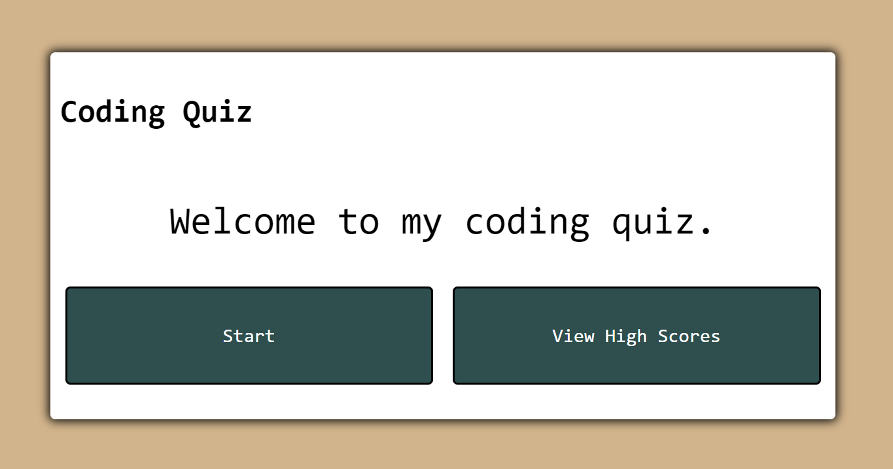
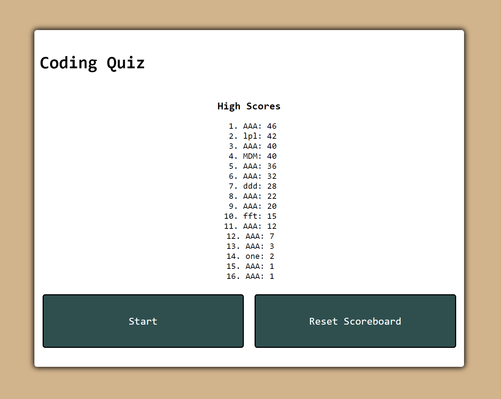

# Web-APIs-Code-Quiz
[](https://opensource.org/licenses/MIT)   

## Description  

The objective of this challenge is to build a trivia app that can runs on a timer, has a time penalty for wrong answers, and can store the time left as a score that can be later viewed on a high scoreboard.

**User Story**
```
AS A coding boot camp student
I WANT to take a timed quiz on JavaScript fundamentals that stores high scores
SO THAT I can gauge my progress compared to my peers
```

**Acceptance Criteria**
```
GIVEN I am taking a code quiz
WHEN I click the start button
THEN a timer starts and I am presented with a question
WHEN I answer a question
THEN I am presented with another question
WHEN I answer a question incorrectly
THEN time is subtracted from the clock
WHEN all questions are answered or the timer reaches 0
THEN the game is over
WHEN the game is over
THEN I can save my initials and my score
```

## Table of Contents  
1. [Description](#description)
2. [Deployment](#deployment)
3. [Optimizations](#optimizations)
4. [Contributing](#contributing)  
5. [Questions](#questions)  
6. [License](#license)

## Deployment

[Deployed Website](https://mmelan000.github.io/Web-APIs-Code-Quiz/)






## Optimizations

- Question array that can be added or subtracted from without editing code.
- High Scoreboard that organizes all highscores by value.
- Visual cues as to whether an answer was right or wrong.

## Contributing  

Follow best practices for naming conventions, indentation, quality comments, etc.  

## Questions  

If you have any questions, please reach out to me either on Github or by Email.
  - **Github:** [mmelan000](https://github.com/mmelan000)
  - **Email:** [m.melanson000@gmail.com](mailto:m.melanson000@gmail.com)

## License  

- [MIT](https://opensource.org/licenses/MIT)